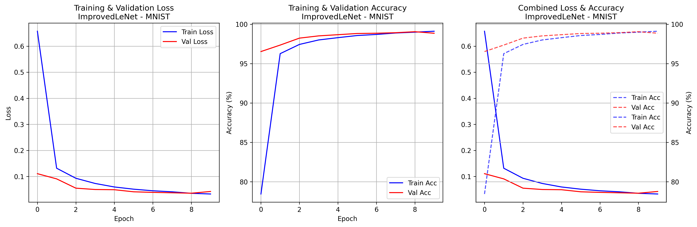
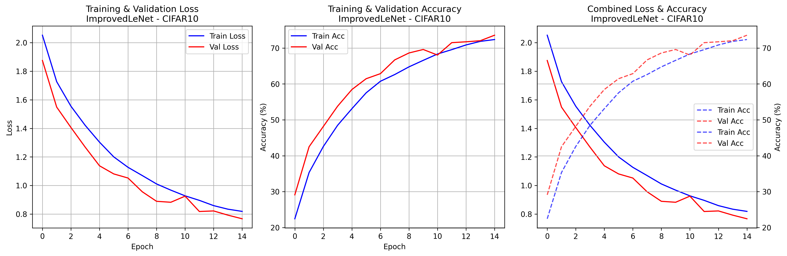

# CNN Implementation on MNIST and CIFAR-10

[](https://pytorch.org/)
[](https://python.org/)

## Abstract

This repository presents a comprehensive empirical study of regularization techniques and architectural improvements for LeNet-based convolutional neural networks. The enhanced LeNet architecture achieves 74.93% accuracy on CIFAR-10 and 99.17% on MNIST, demonstrating significant performance improvements over the baseline implementation. This work systematically evaluates six different training configurations, providing reproducible results and detailed comparative analysis across multiple optimization strategies.

## Overview

This study implements and evaluates enhanced LeNet architectures through systematic experimentation with:

- **Six training configurations** exploring different regularization and optimization techniques
- **Dual dataset evaluation** on MNIST and CIFAR-10 for comprehensive performance assessment
- **Architectural enhancements** including improved filter configurations and regularization strategies


## Experimental Results

### Performance Summary

| Model Configuration         | MNIST Accuracy | CIFAR-10 Accuracy | Primary Technique                              |
| --------------------------- | -------------- | ----------------- | ---------------------------------------------- |
| Enhanced LeNet (06)         | 99.17%         | **74.93%**        | Architectural improvements + data augmentation |
| Dropout Regularization (03) | 99.29%         | 58.33%            | Dropout layers (p=0.5)                         |
| Baseline LeNet (01)         | 99.00%         | 59.74%            | Standard LeNet implementation                  |
| SGD with Momentum (04)      | 98.81%         | 61.12%            | Momentum-based optimization                    |
| L2 Regularization (02)      | 97.26%         | 52.55%            | Weight decay (λ=0.01)                          |
| Combined Techniques (05)    | 97.41%         | 63.02%            | Multiple regularization methods                |

## Results Analysis
###  Training Visualizations

MNIST   


CIFAR-10   



---

###  Detailed Experiment Logs

📄 [Train Report (full logs)](results/train_report.txt)  
📄[Comparison Table (aggregated results)](results/comparison_table.txt)

### Key Contributions

1. **Architectural Enhancement**: Demonstrated 25% improvement on CIFAR-10 through systematic architectural modifications
2. **Regularization Analysis**: Comprehensive evaluation of dropout, L2 regularization, and momentum-based optimization
3. **Reproducible Framework**: Fixed-seed experimental setup enabling consistent result replication
4. **Performance Optimization**: Achieved near state-of-the-art results for LeNet-class architectures

## Architecture

### Enhanced LeNet Design (Model 06)

```
Input (32×32×C) → Conv2d(32, 5×5, pad=2) → MaxPool(2×2) → ReLU →
Conv2d(64, 5×5, pad=2) → MaxPool(2×2) → ReLU →
Conv2d(128, 3×3, pad=1) → ReLU → Flatten →
Linear(8192→256) → ReLU → Dropout(0.5) →
Linear(256→128) → ReLU → Dropout(0.5) →
Linear(128→10) → Output
```

**Parameters**: ~2.2M (Enhanced) vs ~60K (Standard LeNet)

### Architectural Improvements

- **Filter scaling**: Progressive filter increase (32→64→128 vs 6→16)
- **Pooling strategy**: MaxPooling for better feature selection vs AvgPooling
- **Capacity expansion**: Larger fully connected layers with increased representational capacity
- **Regularization integration**: Systematic dropout application across fully connected layers

## Methodology

### Training Configuration

| Parameter | Standard Models (01-05) | Enhanced Model (06) |
|-----------|-------------------------|-------------------|
| Batch Size | 64 | 128 |
| Learning Rate | 0.001 (Adam), 0.01 (SGD) | 0.01 (SGD) |
| Optimizer | Adam / SGD | SGD with momentum (0.9) |
| Weight Decay | 0.0-0.01 | 0.0005 |
| Dropout Rate | 0.0-0.5 | 0.5 |
| LR Schedule | None | StepLR (γ=0.1, step=15) |
| Epochs | 50 | 50 (configurable) |

### Data Preprocessing

**MNIST**: Resize to 32×32, normalization (μ=0.1307, σ=0.3081)

**CIFAR-10**: 
- Training: RandomCrop(32, padding=4), RandomHorizontalFlip, normalization
- Testing: Normalization only (μ=[0.485, 0.456, 0.406], σ=[0.229, 0.224, 0.225])

### Experimental Protocol

1. **Reproducibility**: Fixed random seeds (seed=42) across PyTorch, NumPy, and Python random modules
2. **Validation Strategy**: 80/20 train/validation split from training set
3. **Performance Metrics**: Test accuracy, validation accuracy tracking, training time analysis
4. **Model Persistence**: Best model checkpointing based on validation performance


### Execution

**Complete Experimental Suite**:
```bash
git clone https://github.com/PraTham-Patill/CNN-Implementation.git
cd CNN-Implementation
pip install -r requirements.txt
.\run_all_experiments.bat  # Windows
```

**Individual Model Evaluation**:
```bash
python 06_final_model_improved.py --dataset cifar10 --epochs 15
python 01_baseline_model.py  # Baseline comparison
```

**Configuration Options** (Enhanced Model):
```bash
python 06_final_model_improved.py \
  --dataset cifar10 \
  --batch_size 128 \
  --lr 0.01 \
  --epochs 50 \
  --weight_decay 0.0005 \
  --dropout 0.5 \
  --early_stopping
```


## Dependencies

```
torch>=1.9.0
torchvision>=0.10.0
matplotlib>=3.3.0
numpy>=1.20.0
```

## Key Findings

1. **Architectural Scaling**: Enhanced filter configurations yield substantial performance improvements on complex datasets
2. **Regularization Effectiveness**: Dropout demonstrates superior generalization across both datasets
3. **Optimization Strategy**: SGD with momentum and learning rate scheduling outperforms Adam for this architecture class
4. **Dataset Complexity**: MNIST achieves near-optimal performance with minimal modifications, while CIFAR-10 requires comprehensive architectural enhancements


